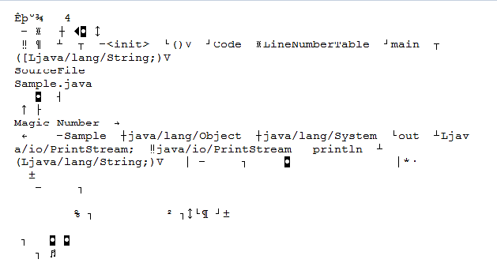
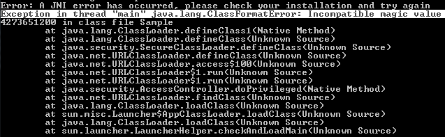
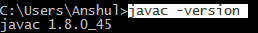
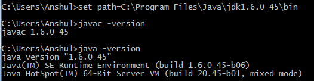
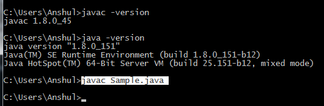
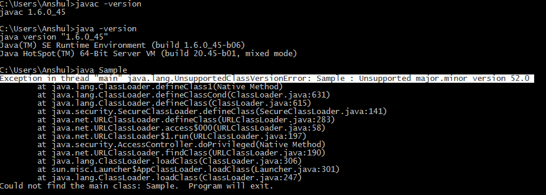

### Java Class File

A Java class file is a file containing Java bytecode and having .class extension that can be executed by JVM. A Java class file is created by a Java compiler from .java files as a result of successful compilation. As we know that a single Java programming language source file (or we can say .java file) may contain one class or more than one class. So if a .java file has more than one class then each class will compile into a separate class files. <br>

For Example: Save this below code as Test.java on your system.<br>

```
// Compiling this Java program would
// result in multiple class files.

class Sample
{

}

// Class Declaration
class Student
{

}
// Class Declaration
class Test
{
       public static void main(String[] args)
       {
           System.out.println("Class File Structure");
       }
}
```

<br>
<em>For Compiling:

javac Test.java</em>
<br>

After compilation there will be 3 class files in corresponding folder named as:

<ul>
<li>Sample.class</li>
<li>Student.class</li>
<li>Test.class</li>
</ul>
<br>

A single class file structure contains attributes that describe a class file.
<br>
<b>Representation of Class File Structure</b>
<br>

```
ClassFile
{
     magic_number;
     minor_version;
     major_version;
     constant_pool_count;
     constant_pool[];
     access_flags;
     this_class;
     super_class;
     interfaces_count;
     interfaces[];
     fields_count;
     fields[];
     methods_count;
     methods[];
     attributes_count;
     attributes[];
}
```

<br>

Elements of class file are as follows:

<ol>
<li>magic_number<li>

The first 4 bytes of class file are termed as magic_number. This is a predefined value which the JVM use to identify whether the .class file is generated by valid compiler or not. The predefined value will be in hexadecimal form i.e. 0xCAFEBABE. Now let’s see what happen when JVM will not find valid magic number. Suppose we have a .java file named as Sample.java as follows and follow step by step process on your system.

```
// class Declaration
class Sample
{
   public static void main(String[] args)
   {
       System.out.println("Magic Number");
   }
}
```

<br>

<ul>
<li>Step 1: Compile using javac Sample.java</li>
<li>Step 2: Now open the Sample.class file. It will looks like following</li>
<br>

<br>
<li>Step 3: Now erase at least single symbol from this Sample.class file from starting of file and save it. Step 4: Now try to run this using java Sample command and see the magic i.e. you will get run time exception (See the highlighted text in below image):</li>
<br>

<br>
<em>Note: This can vary depending on how much you remove the .class file data.</em>
</ul>
<br>
<li>minor_version & major_version</li>
<br>
These both together represents .class file version. JVM will use these versions to identify which version of the compiler generates the current .class file. We denotes the version of class file as M.m where M stands for major_version and m stands for minor_version

<em>Note: Lower version compiler generated .class file can be executed by high version JVM but higher version compiler generated .class file cannot be executed by lower version JVM. If we will try to execute we will get run time exception. This demonstration is for Windows OS as follows: </em>
<br>

<ol>
<li>Step 1</li>

Open a command prompt window and try to check java compiler version and JVM version using following commands respectively (Highlighted text in image are the commands) Output for 1.8 version will be:
<br>

<br>

<li>Step 2</li>

Now check with another version which may be higher or lower than already installed.thisDownload link. And install this to your PC or laptops and note the installation address.<br>

 <li>Step 3</li>
 
Open a second command prompt window and set the path of bin folder of installed jdk installed during 2nd step. And check for Java compiler version ad JVM version.
<br>

<br>

<li>Step 4</li>

Now on 1st command prompt compile the any valid .java file. For example: See above Sample.java file. Compile it as:
<br>

<br>

<li>Step 5</li>

Now on 2nd command prompt window try to run the above compiled code class file and see what happen. There is a run time exception which I have highlighted in below image.
<br>

<br>
<em> Note: Internally jdk 1.5 version means 49.0 and 1.6 means 50.0 and 1.7 means 51.0 etc. class file version where the digits before the decimal point represent the major_version and digits after decimal point represents the minor_version.</em>

<ol>
<li>constant_pool_count</li>
It represents the number of the constants present in the constant pool (When a Java file is compiled, all references to variables and methods are stored in the class's constant pool as a symbolic reference).
<li>constant_pool[]</li>
It represents the information about constants present in constant pool file.
<li>access_flags</li>
It provide the information about the modifiers which are declared to the class file.
<li>this_class</li>
It represents fully qualified name of the class file.
<li>super_class</li>
It represents fully qualified name of the immediate super class of current class. Consider above Sample.java file. When we will compile it, then we can say this_class will be Sample class and super_class will be Object class.
<li>interface_count</li>
It returns the number of interfaces implemented by current class file.
<li>interface[]</li>
It returns interfaces information implemented by current class file.
<li>fields_count</li>
It represents the number of fields (static variable) present in current class file.
<li>fields[]</li>
It represent fields (static variable) information present in current class file.
<li>method_count</li>
It represents number of methods present in current class file.
<li>method[]</li>
It returns information about all methods present in current class file.
<li>attributes_count</li>
It returns the number of attributes (instance variables) present in current class file.
<li>attributes[]</li>
It provides information about all attributes present in current class file.
