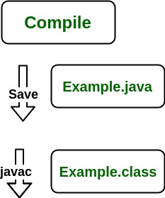
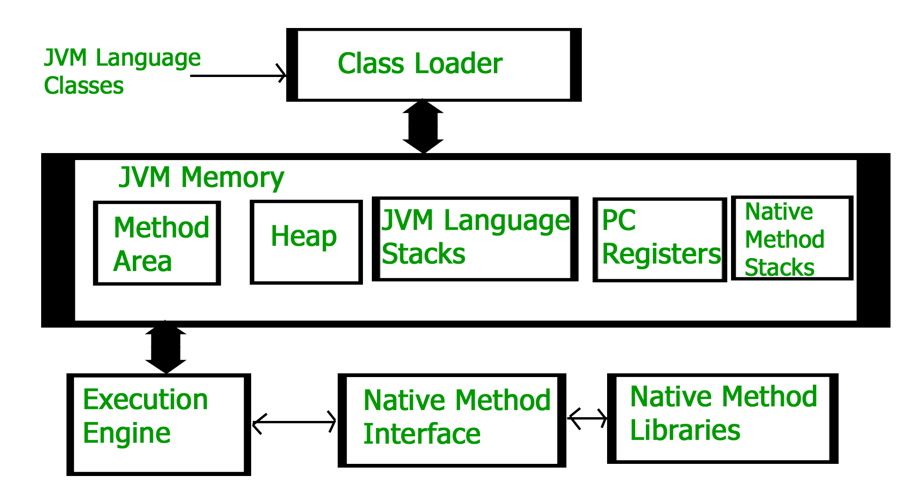

### Differences between JDK, JRE and JVM

Java Development Kit (JDK) is a software development environment used for developing Java applications and applets. It includes the Java Runtime Environment (JRE), an interpreter/loader (Java), a compiler (javac), an archiver (jar), a documentation generator (Javadoc), and other tools needed in Java development.  

Now we need an environment to make a run of our program. Henceforth, JRE stands for "Java Runtime Environment" and may also be written as "Java RTE." The Java Runtime Environment provides the minimum requirements for executing a Java application; it consists of the Java Virtual Machine (JVM), core classes, and supporting files.  

Now let us discuss JVM, which stands out for java virtual machine. It is as follows:

<ul><li>A specification where the working of Java Virtual Machine is specified. But implementation provider is independent to choose the algorithm. Its implementation has been provided by Sun and other companies.</li>
<li>An implementation is a computer program that meets the requirements of the JVM specification.</li>
<li>Runtime Instance Whenever you write a java command on the command prompt to run the java class, an instance of JVM is created.</li>
</ul>
 

Before proceeding to the differences between JDK, JRE, and JVM, let us discuss them in brief first and interrelate them with the image below being proposed. 

 

Don't get confused as we are going to discuss all of them one by one. 

<ol>
<li>JDK (Java Development Kit) is a Kit that provides the environment to develop and execute(run) the Java program. JDK is a kit(or package) that includes two things</li>
<ul>
<li>Development Tools(to provide an environment to develop your java programs)</li>
<li>JRE (to execute your java program).</li>
</ul>

<li> JRE (Java Runtime Environment) is an installation package that provides an environment to only run(not develop) the java program(or application)onto your machine. JRE is only used by those who only want to run Java programs that are end-users of your system.</li>

<li>. JVM (Java Virtual Machine) is a very important part of both JDK and JRE because it is contained or inbuilt in both. Whatever Java program you run using JRE or JDK goes into JVM and JVM is responsible for executing the java program line by line, hence it is also known as an interpreter.</li>
 

Now let us discuss the components of JRE in order to understand its importance of it and perceive how it actually works. For this let us discuss components. 

The components of JRE are as follows:

<ol>
<li>Deployment technologies, including deployment, Java Web Start, and Java Plug-in.</li>
<li>User interface toolkits, including Abstract Window Toolkit (AWT), Swing, Java 2D, Accessibility, Image I/O, Print Service, Sound, drag, and drop (DnD), and input methods.</li>
<li>Integration libraries, including Interface Definition Language (IDL), Java Database Connectivity (JDBC), Java Naming and Directory Interface (JNDI), Remote Method Invocation (RMI), Remote Method Invocation Over Internet Inter-Orb Protocol (RMI-IIOP), and scripting.</li>
<li>Other base libraries, including international support, input/output (I/O), extension mechanism, Beans, Java Management Extensions (JMX), Java Native Interface (JNI), Math, Networking, Override Mechanism, Security, Serialization, and Java for XML Processing (XML JAXP).</li>
<li>Lang and util base libraries, including lang and util, management, versioning, zip, instrument, reflection, Collections, Concurrency Utilities, Java Archive (JAR), Logging, Preferences API, Ref Objects, and Regular Expressions.</li>
<li>Java Virtual Machine (JVM), including Java HotSpot Client and Server Virtual Machines.</li>
 

After having an adequate understanding of the components, now let us discuss the working of JRE. In order to understand how JRE works, let us consider an illustration below as follows: 

<b>Illustration:</b>

Consider a java source file saved as 'Example.java'. The file is compiled into a set of Byte Code that is stored in a ".class" file. Here it will be "Example.class".  

 
<em>Note: From above, media operation computing during the compile time can be interpreted.</em>
 

The following actions occur at runtime as listed below:

<ul>
<li>Class Loader</li>
<li>Byte Code Verifier</li>
<li>Interpreter</li>
<ul>
<li>Execute the Byte Code</li>
<li>Make appropriate calls to the underlying hardware</li>
</ul>
</ul>
 
<b>Now let us discuss in brief how JVM works out. It is as follows:</b>
 

JVM becomes an instance of JRE at the runtime of a Java program. It is widely known as a runtime interpreter.JVM largely helps in the abstraction of inner implementation from the programmers who make use of libraries for their programs from JDK.  

<b>It is mainly responsible for three activities. </b>

<ul>
<li>Loading</li>
<li>Linking</li>
<li>Initialization</li>
 

<b>Similarly, now let us discuss the working of JRE which is as follows: 

<ul>
<li>JVM(Java Virtual Machine) acts as a run-time engine to run Java applications. JVM is the one that actually calls the main method present in a java code. JVM is a part of JRE(Java Runtime Environment).</li>
<li>Java applications are called WORA (Write Once Run Anywhere). This means a programmer can develop Java code on one system and can expect it to run on any other Java-enabled system without any adjustments. This is all possible because of JVM.</li>
<li>When we compile a .java file, .class files(contains byte-code) with the same class names present in .java file are generated by the Java compiler. This .class file goes into various steps when we run it. These steps together describe the whole JVM.</li>
 

