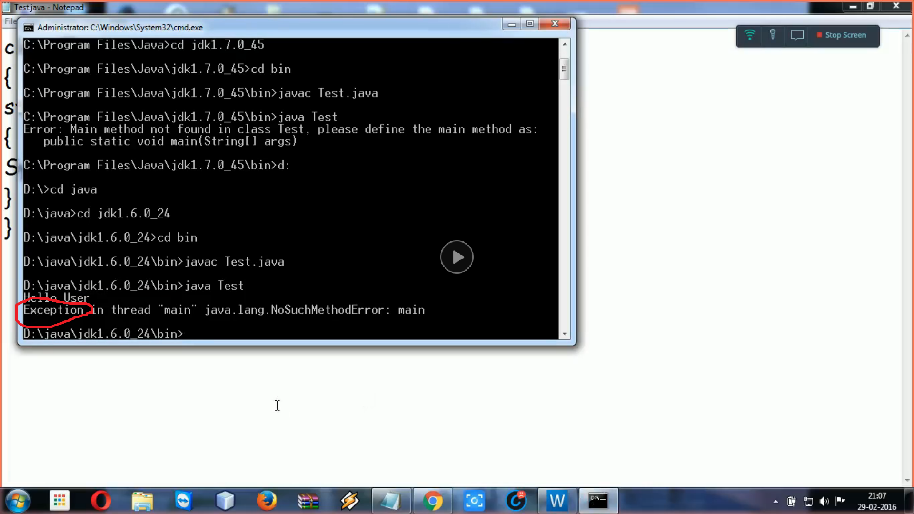

### Is main method compulsory in Java?

The answer to this question depends on the version of java you are using. Prior to JDK 7, the main method was not mandatory in a java program.<br>

<ul>
<li>You could write your full code under static block and it ran normally.</li>
<li>The static block is first executed as soon as the class is loaded before the main(); the method is invoked and therefore before the main() is called. main is usually declared as static method and hence Java doesn't need an object to call the main method.</li>
<li>When you will give the run command(i.e java Test in the below-mentioned program in notepad), so compiler presumes Test is that class in which main() is there and since compiler load, the main() method, static blocks are ready to get executed. So here, it will run static block first and then it will see no main() is there. Therefore it will give "exception", as exception comes while execution. However, if we don't want an exception, we can terminate the program by System.exit(0);</li>
<br>
However, from JDK7 main method is mandatory. The compiler will verify first, whether main() is present or not. If your program doesn't contain the main method, then you will get an error "main method not found in the class". It will give an error (byte code verification error because in it's byte code, main is not there) not an exception because the program has not run yet.
<br>

<b>Note :-</b> However, both the programs will get compile because for compilation we don't need main() method.

```
// This program will successfully run
// prior to JDK 7
public class Test
{
    // static block
    static
    {
        System.out.println("Hello User");
    }
}

```

<br>

Below is the screenshot of the output to help you to visualize the same thing, practically. I have run this program on Notepad so that you can able to understand why that exception has changed into error in the latest version.<br>

<ul>
<li>If run prior to JDK 7</li>

<br>
<output>Output in JAVA 6 version. </output>
<br>
<b>If run on JDK 7,8 and so on...</b>
<output>Output in JAVA 7</output>
