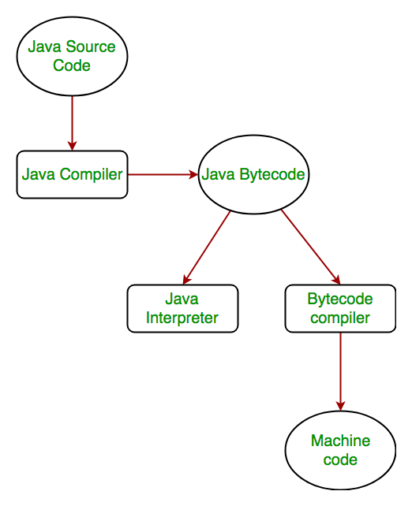

### How is Java platform independent?

The meaning of platform-independent is that the java compiled code(byte code) can run on all operating systems.
A program is written in a language that is a human-readable language. It may contain words, phrases, etc which the machine does not understand. For the source code to be understood by the machine, it needs to be in a language understood by machines, typically a machine-level language. So, here comes the role of a compiler. The compiler converts the high-level language (human language) into a format understood by the machines. Therefore, a compiler is a program that translates the source code for another program from a programming language into executable code. 
This executable code may be a sequence of machine instructions that can be executed by the CPU directly, or it may be an intermediate representation that is interpreted by a virtual machine. This intermediate representation in Java is the Java Byte Code
 

<b>Step by step Execution of Java Program:</b>

<ul>
<li>Whenever, a program is written in JAVA, the javac compiles it.</li>
<li>The result of the JAVA compiler is the .class file or the bytecode and not the machine native code (unlike C compiler).</li>
<li>The bytecode generated is a non-executable code and needs an interpreter to execute on a machine. This interpreter is the JVM and thus the Bytecode is executed by the JVM.
</li>
<li>And finally program runs to give the desired output.</li>
</ul>
 

 

In case of C or C++ (language that are not platform independent), the compiler generates an .exe file which is OS dependent. When we try to run this .exe file on another OS it does not run, since it is OS dependent and hence is not compatible with the other OS.
 

<b>Java is platform-independent but JVM is platform dependent</b>
 

In Java, the main point here is that the JVM depends on the operating system – so if you are running Mac OS X you will have a different JVM than if you are running Windows or some other operating system. This fact can be verified by trying to download the JVM for your particular machine – when trying to download it, you will be given a list of JVMs corresponding to different operating systems, and you will obviously pick whichever JVM is targeted for the operating system that you are running. So we can conclude that JVM is platform-dependent and it is the reason why Java is able to become "Platform Independent".
 

<b>Important Points :</b>

<ul>
<li>In the case of Java, it is the magic of Bytecode that makes it platform independent.</li>
<li>This adds to an important feature in the JAVA language termed as portability. Every system has its own JVM which gets installed automatically when the jdk software is installed. For every operating system separate JVM is available which is capable to read the .class file or byte code.</li>
<li>An important point to be noted is that while JAVA is platform-independent language, the JVM is platform-dependent. Different JVM is designed for different OS and byte code is able to run on different OS.</li>
