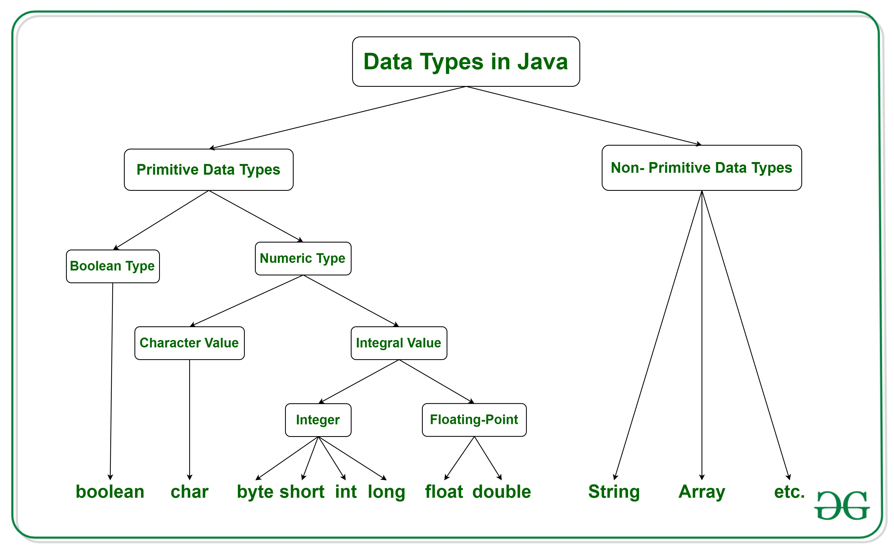
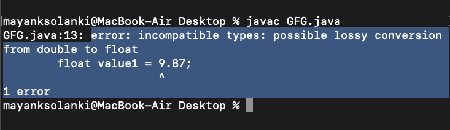

### Data types in Java

Data types are different sizes and values that can be stored in the variable that is made as per convenience and circumstances to cover up all test cases. Also, let us cover up other important ailments that there are majorly two types of languages that are as follows:

<ol>
<li>First, one is a Statically typed language where each variable and expression type is already known at compile time. Once a variable is declared to be of a certain data type, it cannot hold values of other data types. For example C, C++, Java.</li>
<li>The other is Dynamically typed languages. These languages can receive different data types over time. For example Ruby, Python</li>
</ol>
Java is statically typed and also a strongly typed language because, in Java, each type of data (such as integer, character, hexadecimal, packed decimal, and so forth) is predefined as part of the programming language and all constants or variables defined for a given program must be described with one of the data types.

Java has two categories in which data types are segregated 
<ul>
<li>Primitive Data Type: such as boolean, char, int, short, byte, long, float, and double
</li>
<li>Non-Primitive Data Type or Object Data type: such as String, Array, etc.</li>
</ul>
<b>Types Of Primitive Data Types</b>
<br>
Primitive data are only single values and have no special capabilities. There are 8 primitive data types. They are depicted below in tabular format below as follows:

Let us discuss and implement each one of the following data types that are as follows:

<i>Type 1: boolean </i>
Boolean data type represents only one bit of information either true or false which is intended to represent the two truth values of logic and Boolean algebra, but the size of the boolean data type is virtual machine-dependent. Values of type boolean are not converted implicitly or explicitly (with casts) to any other type. But the programmer can easily write conversion code.
<b>Syntax: </b>
<em>boolean booleanVar;</em>

<ul>
<li>Size: Virtual machine dependent</li>

<li>Values: Boolean such as true, false</li>

<li>Default Value: false</li>
</ul>
<b>Example :</b>

```
// Java Program to Demonstrate Boolean Primitive DataType

// Class
class GFG {

    // Main driver method
    public static void main(String args[])
    {

          //Boolean data type is a data type that has one of two possible values (usually denoted true and false).
        // Setting boolean to false and true initially
          boolean a = false;
        boolean b = true;

        // If condition holds
        if (b == true){

            // Print statement
            System.out.println("Hi Geek");
        }
           // If condition holds
          if(a == false){

          // Print statement
            System.out.println("Hello Geek");
        }
    }
}
```

<b>Output</b>
Hi Geek
Hello Geek

<i>Type 2: byte</i>
The byte data type is an 8-bit signed two's complement integer. The byte data type is useful for saving memory in large arrays.
<b>Syntax: </b>
<em>byte byteVar;</em>

Size: 1 byte (8 bits)
Values: -128 to 127
Default Value: 0

<b>Example:</b>

```
// Java Program to demonstrate Byte Data Type

// Class
class GFG {

    // Main driver method
    public static void main(String args[]) {

        byte a = 126;

        // byte is 8 bit value
        System.out.println(a);

        a++;
        System.out.println(a);

        // It overflows here because
        // byte can hold values from -128 to 127
        a++;
        System.out.println(a);

        // Looping back within the range
        a++;
        System.out.println(a);
    }
}
```

<b>Output</b><output>
126
127
-128
-127
</output>
<i>Type 3: short</i>
The short data type is a 16-bit signed two's complement integer. Similar to byte, use a short to save memory in large arrays, in situations where the memory savings actually matters.
<b>Syntax: </b>
<em>short shortVar;</em>

Size: 2 byte (16 bits)
Values: -32, 768 to 32, 767 (inclusive)
Default Value: 0

<i>Type 4: int </i>
It is a 32-bit signed two's complement integer.
<b>Syntax: </b>
<em>int intVar;</em>
Size: 4 byte ( 32 bits )
Values: -2, 147, 483, 648 to 2, 147, 483, 647 (inclusive)
<imp>Note: The default value is '0'
Remember: In Java SE 8 and later, we can use the int data type to represent an unsigned 32-bit integer, which has a value in the range [0, 232-1]. Use the Integer class to use the int data type as an unsigned integer.</imp>

<em>Type 5: long</em>
The range of a long is quite large. The long data type is a 64-bit two's complement integer and is useful for those occasions where an int type is not large enough to hold the desired value.
<b>Syntax: </b>
long longVar;
Size: 8 byte (64 bits)  
Values: {-9, 223, 372, 036, 854, 775, 808} to {9, 223, 372, 036, 854, 775, 807} (inclusive)
<imp>
Note: The default value is '0'.
Remember: In Java SE 8 and later, you can use the long data type to represent an unsigned 64-bit long, which has a minimum value of 0 and a maximum value of 264-1. The Long class also contains methods like comparing Unsigned, divide Unsigned, etc to support arithmetic operations for unsigned long.
</imp>
<em>Type 6: float</em>
The float data type is a single-precision 32-bit IEEE 754 floating-point. Use a float (instead of double) if you need to save memory in large arrays of floating-point numbers.
<b>Syntax: </b>
float floatVar;
Size: 4 byte (32 bits)
Values: upto 7 decimal digits
<imp>Note: The default value is '0.0'.</imp>

```
// Java Program to Illustrate Float Primitive Data Type

// Importing required classes
import java.io.*;

// Class
class GFG {

    // Main driver method
    public static void main(String[] args)
    {
        // Declaring and initializing float value

        // float value1 = 9.87;
        // Print statement
        // System.out.println(value1);
        float value2 = 9.87f;
        System.out.println(value2);
    }
}
```

<b>Output</b>
<output>9.87</output>
If we uncomment lines no 14,15,16 then the output would have been totally different as we would have faced an error.

<em>Type 7: double</em>
The double data type is a double-precision 64-bit IEEE 754 floating-point. For decimal values, this data type is generally the default choice.
<b>Syntax:</b>
<em>double doubleVar;</em>
Size: 8 bytes or 64 bits
Values: Upto 16 decimal digits
<imp>
Note:
The default value is taken as '0.0'.
Both float and double data types were designed especially for scientific calculations, where approximation errors are acceptable. If accuracy is the most prior concern then, it is recommended not to use these data types and use BigDecimal class instead. </imp>
It is recommended to go through rounding off errors in java.
<em>Type 8: char</em>
The char data type is a single 16-bit Unicode character.
<b>Syntax: </b>
char charVar;
Size: 2 byte (16 bits)
Values: '\u0000' (0) to '\uffff' (65535)
<imp>Note: The default value is '\u0000'</imp>

<b>You must be wondering why is the size of char 2 bytes in Java? </b>
So, in other languages like C/C++ uses only ASCII characters, and to represent all ASCII characters 8-bits is enough. But java uses the Unicode system not the ASCII code system and to represent the Unicode system 8 bits is not enough to represent all characters so java uses 2 bytes for characters. Unicode defines a fully international character set that can represent most of the world's written languages. It is a unification of dozens of character sets, such as Latin, Greeks, Cyrillic, Katakana, Arabic, and many more.
<b>Example :</b>

```
// Java Program to Demonstrate Char Primitive Data Type

// Class
class GFG {

    // Main driver method
    public static void main(String args[])
    {

        // Creating and initializing custom character
        char a = 'G';

        // Integer data type is generally
        // used for numeric values
        int i = 89;

        // use byte and short
        // if memory is a constraint
        byte b = 4;

        // this will give error as number is
        // larger than byte range
        // byte b1 = 7888888955;

        short s = 56;

        // this will give error as number is
        // larger than short range
        // short s1 = 87878787878;

        // by default fraction value
        // is double in java
        double d = 4.355453532;

        // for float use 'f' as suffix as standard
        float f = 4.7333434f;

          //need to hold big range of numbers then we need this data type
          long l = 12121;

          System.out.println("char: " + a);
        System.out.println("integer: " + i);
        System.out.println("byte: " + b);
        System.out.println("short: " + s);
        System.out.println("float: " + f);
        System.out.println("double: " + d);
          System.out.println("long: " + l);
    }
}

```

<b>Output</b><output>
char: G
integer: 89
byte: 4
short: 56
float: 4.7333436
double: 4.355453532
long: 12121</output>

<b>Non-Primitive Data Type or Reference Data Types</b>
The Reference Data Types will contain a memory address of variable values because the reference types won’t store the variable value directly in memory. They are strings, objects, arrays, etc.

<ol>
<li>A: Strings </li>
Strings are defined as an array of characters. The difference between a character array and a string in Java is, that the string is designed to hold a sequence of characters in a single variable whereas, a character array is a collection of separate char type entities. Unlike C/C++, Java strings are not terminated with a null character.

<b>Syntax: Declaring a string</b>
// Declare String without using new operator 
String s = "GeeksforGeeks"; 

// Declare String using new operator 
String s1 = new String("GeeksforGeeks"); 

