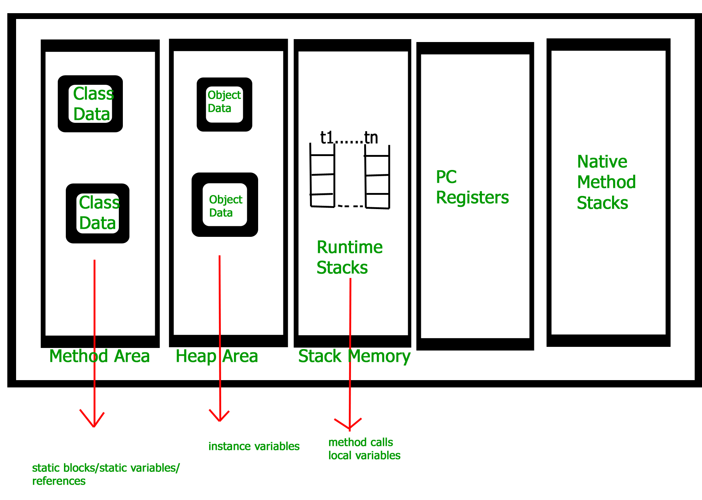

### How JVM Works - JVM Architecture?

VM(Java Virtual Machine) acts as a run-time engine to run Java applications. JVM is the one that actually calls the main method present in a java code. JVM is a part of JRE(Java Runtime Environment).<br>

ava applications are called WORA (Write Once Run Anywhere). This means a programmer can develop Java code on one system and can expect it to run on any other Java-enabled system without any adjustment. This is all possible because of JVM.<br>

When we compile a .java file, .class files(contains byte-code) with the same class names present in .java file are generated by the Java compiler. This .class file goes into various steps when we run it. These steps together describe the whole JVM. <br>


<br>

<b>Class Loader Subsystem</b>

It is mainly responsible for three activities.

<ul>
<li>Loading</li>
<li>Linking</li>
<li>Initialization</li>
</ul>
<br>

<b>Loading: </b> The Class loader reads the “.class” file, generate the corresponding binary data and save it in the method area. For each “.class” file, JVM stores the following information in the method area.

<ul>
<li>The fully qualified name of the loaded class and its immediate parent class.</li>
<li>Whether the “.class” file is related to Class or Interface or Enum.</li>
<li>Modifier, Variables and Method information etc.</li>
</ul>

After loading the “.class” file, JVM creates an object of type Class to represent this file in the heap memory. Please note that this object is of type Class predefined in java.lang package. These Class object can be used by the programmer for getting class level information like the name of the class, parent name, methods and variable information etc. To get this object reference we can use getClass() method of Object class.

```
// A Java program to demonstrate working
// of a Class type object created by JVM
// to represent .class file in memory.
import java.lang.reflect.Field;
import java.lang.reflect.Method;

// Java code to demonstrate use
// of Class object created by JVM
public class Test {
    public static void main(String[] args)
    {
        Student s1 = new Student();

        // Getting hold of Class
        // object created by JVM.
        Class c1 = s1.getClass();

        // Printing type of object using c1.
        System.out.println(c1.getName());

        // getting all methods in an array
        Method m[] = c1.getDeclaredMethods();
        for (Method method : m)
            System.out.println(method.getName());

        // getting all fields in an array
        Field f[] = c1.getDeclaredFields();
        for (Field field : f)
            System.out.println(field.getName());
    }
}

// A sample class whose information
// is fetched above using its Class object.
class Student {
    private String name;
    private int roll_No;

    public String getName() { return name; }
    public void setName(String name) { this.name = name; }
    public int getRoll_no() { return roll_No; }
    public void setRoll_no(int roll_no)
    {
        this.roll_No = roll_no;
    }
}
```

<em>Output: </em>

```
Student
getName
setName
getRoll_no
setRoll_no
name
roll_No
```

<imp>Note : For every loaded “.class” file, only one object of the class is created. </imp>

<p>Student s2 = new Student();
// c2 will point to same object where 
// c1 is pointing
Class c2 = s2.getClass();
System.out.println(c1==c2); // true
</p>

<b>Linking :</b> Performs verification, preparation, and (optionally) resolution.

<ul>
<li>Verification : It ensures the correctness of the .class file i.e. it checks whether this file is properly formatted and generated by a valid compiler or not. If verification fails, we get run-time exception java.lang.VerifyError. This activity is done by the component ByteCodeVerifier. Once this activity is completed then the class file is ready for compilation.</li>
<li>Preparation : JVM allocates memory for class variables and initializing the memory to default values.</li>
<li>Resolution : It is the process of replacing symbolic references from the type with direct references. It is done by searching into the method area to locate the referenced entity.</li>
</ul>

<b>Initialization :</b> In this phase, all static variables are assigned with their values defined in the code and static block(if any). This is executed from top to bottom in a class and from parent to child in the class hierarchy.
In general, there are three class loaders :

<ul>
<li>Bootstrap class loader : Every JVM implementation must have a bootstrap class loader, capable of loading trusted classes. It loads core java API classes present in the “JAVA_HOME/jre/lib” directory. This path is popularly known as the bootstrap path. It is implemented in native languages like C, C++.</li>
<li>Extension class loader : It is a child of the bootstrap class loader. It loads the classes present in the extensions directories “JAVA_HOME/jre/lib/ext”(Extension path) or any other directory specified by the java.ext.dirs system property. It is implemented in java by the sun.misc.Launcher$ExtClassLoader class</li>
<li>System/Application class loader : It is a child of the extension class loader. It is responsible to load classes from the application classpath. It internally uses Environment Variable which mapped to java.class.path. It is also implemented in Java by the sun.misc.Launcher$AppClassLoader class.</li>
</ul>

```
// Java code to demonstrate Class Loader subsystem
public class Test {
    public static void main(String[] args)
    {
        // String class is loaded by bootstrap loader, and
        // bootstrap loader is not Java object, hence null
        System.out.println(String.class.getClassLoader());

        // Test class is loaded by Application loader
        System.out.println(Test.class.getClassLoader());
    }
}
```

<b>Output</b>
<em>
null
jdk.internal.loader.ClassLoaders$AppClassLoader@8bcc55f
</em>

<b>Note :</b> JVM follows the Delegation-Hierarchy principle to load classes. System class loader delegate load request to extension class loader and extension class loader delegate request to the bootstrap class loader. If a class found in the boot-strap path, the class is loaded otherwise request again transfers to the extension class loader and then to the system class loader. At last, if the system class loader fails to load class, then we get run-time exception java.lang.ClassNotFoundException. <br>


<br>

<b>JVM Memory </b>

<ol>
<li>Method area :</li> In the method area, all class level information like class name, immediate parent class name, methods and variables information etc. are stored, including static variables. There is only one method area per JVM, and it is a shared resource.
<li>Heap area :</li> Information of all objects is stored in the heap area. There is also one Heap Area per JVM. It is also a shared resource.
<li>Stack area :</li> For every thread, JVM creates one run-time stack which is stored here. Every block of this stack is called activation record/stack frame which stores methods calls. All local variables of that method are stored in their corresponding frame. After a thread terminates, its run-time stack will be destroyed by JVM. It is not a shared resource.
<li>PC Registers :</li> Store address of current execution instruction of a thread. Obviously, each thread has separate PC Registers.
<li>Native method stacks :</li> For every thread, a separate native stack is created. It stores native method information.
<br>
</ol>


<br>

<b>Execution Engine </b>
Execution engine executes the “.class” (bytecode). It reads the byte-code line by line, uses data and information present in various memory area and executes instructions. It can be classified into three parts:

<ul>
<li>Interpreter: It interprets the bytecode line by line and then executes. The disadvantage here is that when one method is called multiple times, every time interpretation is required</li>
<li>Just-In-Time Compiler(JIT) : It is used to increase the efficiency of an interpreter. It compiles the entire bytecode and changes it to native code so whenever the interpreter sees repeated method calls, JIT provides direct native code for that part so re-interpretation is not required, thus efficiency is improved.</li>
<li>Garbage Collector: It destroys un-referenced objects. For more on Garbage Collector, refer Garbage Collector.</li>
</ul>

<b>Java Native Interface (JNI) :</b>
It is an interface that interacts with the Native Method Libraries and provides the native libraries(C, C++) required for the execution. It enables JVM to call C/C++ libraries and to be called by C/C++ libraries which may be specific to hardware.

<b>Native Method Libraries :</b>
It is a collection of the Native Libraries(C, C++) which are required by the Execution Engine.
